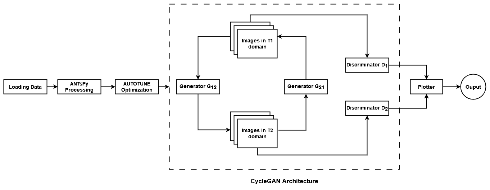
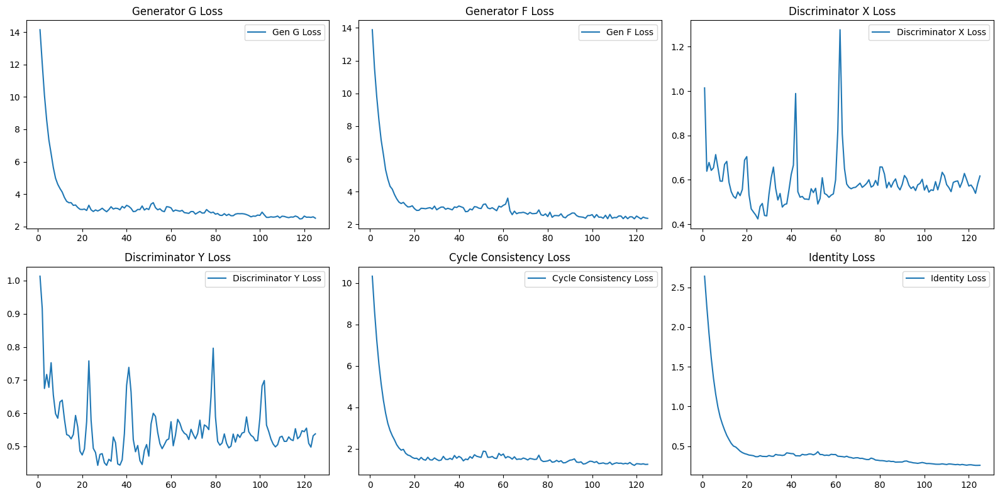

# CycleGAN - for MRI Image Prediction

## Overview
<!--  -->


Implementing  [**CycleGAN**](https://github.com/junyanz/CycleGAN) [[Paper](https://arxiv.org/abs/1703.10593)]  to translate T1 to T2 MRI images and vice versa can be crucial in medical imaging. It enables cross-modal image synthesis without paired datasets, saving time and resources in MRI acquisition. Clinicians can generate missing sequences, improving diagnostic capabilities by providing complementary information from both T1 and T2 modalities. This can enhance image analysis, reduce patient scan times, and lower costs. Additionally, it allows for more flexible retrospective studies where only one MRI modality is available, making it easier to explore conditions requiring multimodal data for better diagnostic accuracy.

## Getting Started

### Installation

Use Python 3.5+ 

```bash
git clone https://github.com/vidit21srivastava/mri-gan.git
pip install -r requirements.txt
cd mri-gan
```

### How to run the model?

#### Dataset
- Unzip the dataset in the dataset folder.

#### Running the Script with Custom Parameters

You can now run the script from the command line with custom arguments. For example:

```bash
python main.py --data_dir_t1 "./custom_path/Tr1/" --data_dir_t2 "./custom_path/Tr2/" --img_height 128 --img_width 128 --batch_size 32 --epochs 50
```
This command will:
- Load the T1 MRI dataset from ./custom_path/Tr1/.
- Load the T2 MRI dataset from ./custom_path/Tr2/.
- Resize images to 128x128.
- Train the model with a batch size of 32.
- Train for 50 epochs.

Default Values

If you don’t provide any arguments, the script will use the default values specified in the add_argument() calls. For example, running:

```bash
python main.py
```

This will train the model with the default settings:

- T1 dataset in ./Tr1/
- T2 dataset in ./Tr2/
- Image dimensions: 256x256
- Batch size: 16
- Buffer size: 1000
- Epochs: 125

## Key Pipeline Stages

<div style="text-align: center;">
    
</div>


1. **Data Loading**

    The pipeline starts by loading T1 and T2 MRI images in PNG format from specified directories using pathlib.
    Images are loaded as NumPy arrays using Pillow for grayscale MRI images.

2. **ANTsPy Preprocessing**

    ANTsPy is used to apply advanced medical image processing techniques:
    - N4 Bias Field Correction: Corrects intensity non-uniformities in MRI images, which are common due to scanner imperfections.
    - Intensity Normalization: Normalizes the image intensity to a range between 0 and 1, making the dataset consistent and easier for the model to process.
    - Image Resampling: Resizes each MRI image to the target dimensions (e.g., 256x256) using voxel-based resampling, ensuring the spatial resolution is maintained.

3. **Efficient Input Pipeline with AUTOTUNE**

    TensorFlow's AUTOTUNE is employed to automatically tune the number of parallel calls and buffer sizes during data loading and preprocessing.
    This ensures that the data pipeline can load, preprocess, and feed images to the model in parallel with training, minimizing idle GPU/CPU time and maximizing efficiency.

    `tf.py_function` is used to wrap the ANTsPy preprocessing functions within TensorFlow’s map() function, allowing non-TensorFlow operations (like ANTsPy processing) to be smoothly integrated.

4. **CycleGAN Model Architecture**

    The preprocessed T1 and T2 MRI images are used to train a CycleGAN. This architecture consists of:
    - Two Generators: One for generating T2 images from T1, and another for generating T1 images from T2.
    - Two Discriminators: One to discriminate between real and generated T1 images, and the other for T2 images.

    The CycleGAN learns to translate between T1 and T2 image styles, helping in generating synthetic versions of either MRI modality from the other.

5. **Training Loop**

    The training process iterates for a specified number of epochs (e.g., 125).
    During each epoch:
    - The model processes batches of preprocessed MRI images from the TensorFlow dataset.
    - Losses for the generators and discriminators are calculated and used to update the model parameters.
    - Images are generated using the current state of the model and visualized to show progress.

6. **Visualization of Results**

    At the end of each epoch, the pipeline generates synthetic MRI images and visualizes the results by:
    - Displaying the original T1 and T2 MRI images.
    - Displaying the translated T1-to-T2 and T2-to-T1 images produced by the generators.

    These visualizations help monitor the performance of the model and check whether the CycleGAN is successfully learning the transformation between MRI modalities.

### Components in the Pipeline

1. Data Processing (`data_processing.py`):

    Handles image loading, ANTsPy-based preprocessing, and resizing.
    Utilizes AUTOTUNE to optimize the input data pipeline.

2. Model Components (`mri_gan.py`):

    Defines the CycleGAN architecture, including generator and discriminator models.

3. Loss Functions (`loss.py`):

    Implements the loss functions used for training the CycleGAN, including adversarial loss, cycle consistency loss, and identity loss.

4. Training Script (`training.py`):

    Handles the training loop, including backpropagation, weight updates, and checkpoint management.
    Applies data augmentation and parallel processing using AUTOTUNE for efficient model training.

5. Visualization (`plotting.py`):

    Provides functions to visualize images generated during the training process, making it easier to evaluate the quality of the generated synthetic MRI images.

## Results

<div style="text-align: center;">
    
</div>


The training process is showing positive signs of convergence. The generators are learning to produce realistic images, and the discriminators are learning to distinguish between real and generated images. The cycle and identity losses are also behaving as expected, indicating that the model is performing well in transforming images between the two domains (T1 to T2 and vice versa). The model has stabilized after about 60–80 epochs, but the fluctuations in the discriminator losses suggest that further fine-tuning or continued training could still lead to further improvements.